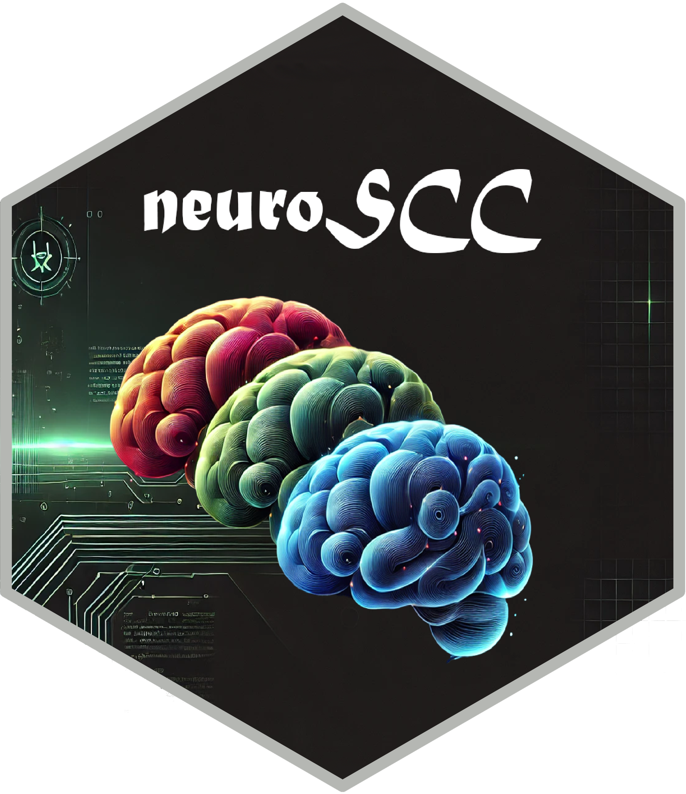

# neuroSCC

<a href="https://github.com/iguanamarina/neuroSCC">
 </a>

[](https://www.repostatus.org/)
[](https://www.tidyverse.org/lifecycle/)
[](https://github.com/iguanamarina/neuroSCC/graphs/contributors)
[](https://github.com/iguanamarina/neuroSCC/commits/main)
[](https://github.com/iguanamarina/neuroSCC/issues)
[](https://github.com/iguanamarina/neuroSCC)

🚀 **`neuroSCC` facilitates structured processing of PET neuroimaging
data for the estimation of Simultaneous Confidence Corridors (SCCs).**
It integrates neuroimaging and statistical methodologies to:

- 📥 **Load and preprocess** PET neuroimaging files.  
- 🔬 **Transform data** for a **Functional Data Analysis (FDA)**
  setup.  
- 🎯 **Extract meaningful contours** and identify significant SCC
  regions.  
- 📊 **Compare SCC-based analyses** with gold-standard methods like
  **SPM**.

The package bridges established **[neuroimaging
tools](https://github.com/bjw34032/oro.nifti)** (`oro.nifti`) with
advanced **[statistical
methods](https://github.com/FIRST-Data-Lab/ImageSCC)** (`ImageSCC`),
supporting **one-group, two-group, and single-patient vs. group
comparisons**.

📌 Developed as part of the **Ph.D. thesis**: *“Development of
statistical methods for neuroimage data analysis towards early diagnosis
of neurodegenerative diseases”*, by Juan A. Arias at **University of
Santiago de Compostela (Spain)**.

------------------------------------------------------------------------

# 📖 Table of Contents

<details open="open">
<summary>
📖 Click to expand
</summary>
<ol>
<li>
<a href="#about-the-project"> ➤ About The Project</a>
</li>
<li>
<a href="#installation"> ➤ Installation</a>
</li>
<li>
<a href="#basic-usage"> ➤ Basic Usage</a>
</li>
<li>
<a href="#functions-overview"> ➤ Functions Overview</a>
</li>
<li>
<a href="#vignette"> ➤ Vignette & Full Workflow</a>
</li>
<li>
<a href="#references"> ➤ References</a>
</li>
</ol>
</details>

------------------------------------------------------------------------

# 1️⃣ About the Project

## Why Use `neuroSCC`?

PET neuroimaging data is **complex**, requiring careful **processing and
statistical validation**. `neuroSCC` is designed to:

✔ **Automate Preprocessing**: Load, clean, and structure PET data 📂  
✔ **Standardize Analysis**: Convert images into FDA-compatible formats
🔬  
✔ **Provide SCC Estimations**: Identify **significant regions** with
confidence 🎯  
✔ **Enable Method Comparisons**: SCC vs. **SPM performance evaluation**
📊

It is **particularly suited for**: - **Clinical neuroimaging research**
(Alzheimer’s disease, neurodegeneration). - **Statistical validation of
imaging methods**. - **Comparisons between SCC and other statistical
approaches**.

------------------------------------------------------------------------

# 2️⃣ Installation

## 📦 From GitHub

## 🔜 From CRAN (Future)

------------------------------------------------------------------------

# 3️⃣ Basic Usage

### **Minimal Working Example**

``` r
# Load package
library(neuroSCC)

# Load a PET neuroimaging file
pet_data <- neuroCleaner("path/to/file.nii")

# Process for functional data analysis
processed_data <- matrixCreator(pet_data)

# Compute SCCs
SCC_result <- ImageSCC::scc.image(processed_data)

# Visualize results
plot(SCC_result)
```

------------------------------------------------------------------------

# 4️⃣ Functions Overview

This package contains **several core functions** for neuroimaging data
processing:

------------------------------------------------------------------------

### 🧼 neuroCleaner(): Load & Clean PET Data

`neuroCleaner()` reads **NIFTI neuroimaging files**, extracts
**voxel-wise data**, and structures it into a **tidy data frame**.  
It is the **first preprocessing step**, ensuring that PET images are
cleaned and formatted for further analysis. It also integrates
demographic data when available.

*Example with Code:*
<details>
<summary>
Click to expand
</summary>

``` r
# Load a NIFTI file and structure the data
clean_data <- neuroCleaner("path/to/file.nii")
head(clean_data)
```

</details>

------------------------------------------------------------------------

### 📊 databaseCreator(): Convert Multiple Files into a Database

`databaseCreator()` scans a directory for **PET image files**, processes
each with `neuroCleaner()`, and compiles them into a **structured data
frame**.  
This function is **critical for batch analysis**, preparing data for
group-level SCC comparisons.

*Example with Code:*
<details>
<summary>
Click to expand
</summary>

``` r
# Process multiple PET images into a database
database <- databaseCreator(pattern = ".*nii")
```

</details>

------------------------------------------------------------------------

### 📐 getDimensions(): Extract Image Dimensions

`getDimensions()` extracts the **spatial dimensions** of a neuroimaging
file, returning the number of **voxels in the x, y, and z axes**.  
This ensures proper alignment of neuroimaging data before further
processing.

*Example with Code:*
<details>
<summary>
Click to expand
</summary>

``` r
# Extract spatial dimensions of a PET scan
dims <- getDimensions("path/to/file.nii")
```

</details>

------------------------------------------------------------------------

### 📊 matrixCreator(): Convert PET Data into a Functional Matrix

`matrixCreator()` transforms **PET imaging data into a matrix format**
for functional data analysis.  
Each row represents a subject’s PET data, formatted to align with FDA
methodologies.

*Example with Code:*
<details>
<summary>
Click to expand
</summary>

``` r
# Convert database of PET images into a matrix format
matrix_data <- matrixCreator(database, pattern = ".*nii", paramZ = 35)
```

</details>

------------------------------------------------------------------------

### 📉 meanNormalization(): Normalize Data

`meanNormalization()` performs **row-wise mean normalization**,
adjusting intensity values across subjects.  
This removes global intensity differences, making datasets comparable in
**Functional Data Analysis (FDA)**.

*Example with Code:*
<details>
<summary>
Click to expand
</summary>

``` r
# Apply mean normalization for functional data analysis
normalized_matrix <- meanNormalization(matrix_data)
```

</details>

------------------------------------------------------------------------

### 📈 neuroContour(): Extract Contours

`neuroContour()` extracts **region boundaries (contours) from
neuroimaging data**.  
It is particularly useful for defining **masks or Regions of Interest
(ROIs)** before SCC computation.

*Example with Code:*
<details>
<summary>
Click to expand
</summary>

``` r
# Extract region contours from neuroimaging data
contours <- neuroContour("path/to/file.nii")
```

</details>

------------------------------------------------------------------------

### 🔺 getPoints(): Identify Significant SCC Differences

`getPoints()` identifies **regions with significant differences** from
an SCC computation.  
After `ImageSCC::scc.image()` computes SCCs, `getPoints()` extracts
**coordinates where group differences exceed confidence boundaries**.

*Example with Code:*
<details>
<summary>
Click to expand
</summary>

``` r
# Extract significant points from SCC results
points <- getPoints(SCC_result)
```

</details>

------------------------------------------------------------------------

### 🏷️ processROIs(): Process ROI Data

`processROIs()` processes **Regions of Interest (ROIs)** from
neuroimaging files.  
It extracts voxel coordinates for **predefined hypoactive regions**,
structuring them for SCC analysis.

*Example with Code:*
<details>
<summary>
Click to expand
</summary>

``` r
# Process ROIs from a set of files
processROIs(roiDir = "path/to/rois", regions = c("region1", "region2"), numbers = 1:10)
```

</details>

------------------------------------------------------------------------

# 5️⃣ Vignette & Full Workflow

A full walkthrough of using `neuroSCC` from start to finish is available
in the vignette.

[📄 **Click here to view the full
vignette**](https://github.com/iguanamarina/neuroSCC/vignettes/workflow.html)

------------------------------------------------------------------------

# 6️⃣ References

- Wang, Y., Wang, G., Wang, L., Ogden, R.T. (2020). *Simultaneous
  Confidence Corridors for Mean Functions in Functional Data Analysis of
  Imaging Data*. Biometrics, 76(2), 427-437.  
- [Ph.D. Thesis: Development of statistical methods for neuroimage data
  analysis towards early diagnosis of neurodegenerative
  diseases](https://github.com/iguanamarina/PhD-thesis)

------------------------------------------------------------------------

# 📢 **Contributing & Feedback**

We welcome **contributions, feedback, and issue reports** from the
community! If you would like to help improve `neuroSCC`, here’s how you
can get involved:

------------------------------------------------------------------------

## **🐛 Found a Bug? Report an Issue**

If you encounter a bug, incorrect result, or any unexpected behavior,
please:

1.  Check **[existing
    issues](https://github.com/iguanamarina/neuroSCC/issues)** to see if
    it has already been reported.  
2.  If not, [open a new
    issue](https://github.com/iguanamarina/neuroSCC/issues/new) and
    include:
    - A **clear description** of the problem.  
    - Steps to **reproduce** the issue.  
    - Any **error messages** or screenshots (if applicable).

------------------------------------------------------------------------

## **💡 Have an Idea? Suggest a Feature**

We are always looking to improve `neuroSCC`. If you have a **suggestion
for a new feature** or an enhancement, please:

1.  Browse the **[open
    discussions](https://github.com/iguanamarina/neuroSCC/discussions)**
    to see if your idea has already been suggested.  
2.  If not, start a **new discussion thread** with:
    - A **detailed explanation** of your idea.  
    - Why it would **improve** the package.  
    - Any **relevant references** or examples from similar projects.

------------------------------------------------------------------------

## **🔧 Want to Contribute Code?**

We love contributions! To submit **a pull request (PR)**:

1.  **Fork the repository** on GitHub.  

2.  **Clone your fork** to your local machine:

    ``` r
    git clone https://github.com/YOUR_USERNAME/neuroSCC.git
    cd neuroSCC
    ```

3.  **Create a new branch** for your feature or fix:

    ``` r
    git checkout -b feature-new-functionality
    ```

4.  **Make your changes** and commit them:

    ``` r
    git add .
    git commit -m "Added new functionality XYZ"
    ```

5.  **Push your changes** to your fork:

    ``` r
    git push origin feature-new-functionality
    ```

6.  **Submit a pull request** (PR) from your forked repository to the
    main `neuroSCC` repository.

Before submitting, please:  
✔ Ensure your code **follows the package style guidelines**.  
✔ Add **documentation** for any new functions or features.  
✔ Run **`devtools::check()`** to verify that all package tests pass.

------------------------------------------------------------------------

## **📜 Code of Conduct**

We aim to **foster a welcoming and inclusive** open-source community.
Please read our **[Code of
Conduct](https://github.com/iguanamarina/neuroSCC/blob/main/CODE_OF_CONDUCT.md)**
before contributing.

------------------------------------------------------------------------

## **📧 Contact & Support**

For questions not related to bugs or feature requests, feel free to:  
📬 Email the maintainer: <juanantonio.arias.lopez@usc.es>  
💬 Join the discussion on **[GitHub
Discussions](https://github.com/iguanamarina/neuroSCC/discussions)**

------------------------------------------------------------------------

## **Why Contribute?**

By contributing to `neuroSCC`, you:  
✔ Help **improve** neuroimaging research tools.  
✔ Gain **experience** in open-source development.  
✔ Become part of a growing **scientific community**.

Every contribution—big or small—**is greatly appreciated**! 🚀

------------------------------------------------------------------------

------------------------------------------------------------------------

------------------------------------------------------------------------
