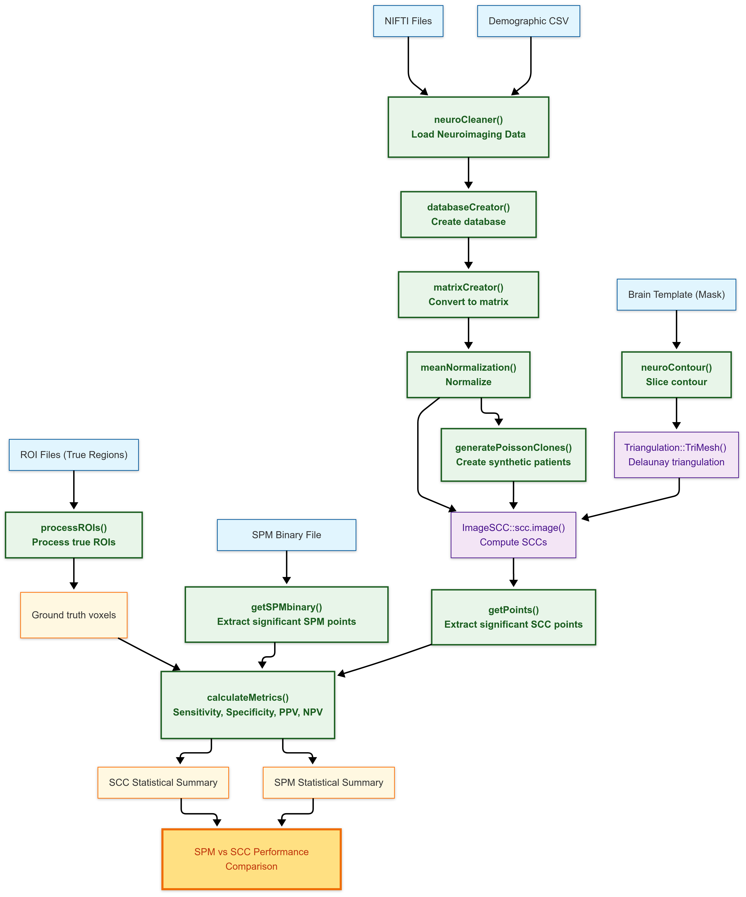

# neuroSCC

<a href="https://github.com/iguanamarina/neuroSCC">
 </a>

[](https://www.repostatus.org/)
[](https://www.tidyverse.org/lifecycle/)
[](https://github.com/iguanamarina/neuroSCC/graphs/contributors)
[](https://github.com/iguanamarina/neuroSCC/commits/main)
[](https://github.com/iguanamarina/neuroSCC/issues)
[](https://github.com/iguanamarina/neuroSCC)

🚀 **`neuroSCC` facilitates structured processing of PET neuroimaging
data for the estimation of Simultaneous Confidence Corridors (SCCs).**
It integrates neuroimaging and statistical methodologies to:

- 📥 **Load and preprocess** PET neuroimaging files.  
- 🔬 **Transform data** for a **Functional Data Analysis (FDA)**
  setup.  
- 🎯 **Extract meaningful contours** and identify significant SCC
  regions.  
- 📊 **Compare SCC-based analyses** with gold-standard methods like
  **SPM**.

The package bridges established **[neuroimaging
tools](https://github.com/bjw34032/oro.nifti)** (`oro.nifti`) with
advanced **[statistical
methods](https://github.com/FIRST-Data-Lab/ImageSCC)** (`ImageSCC`),
supporting **one-group, two-group, and single-patient vs. group
comparisons**.

📌 Developed as part of the **Ph.D. thesis**: *“Development of
statistical methods for neuroimage data analysis towards early diagnosis
of neurodegenerative diseases”*, by Juan A. Arias at **University of
Santiago de Compostela (Spain)**.

------------------------------------------------------------------------

# 📖 Table of Contents

- [About the Project](#about-the-project)
- [Installation](#installation)
- [Basic Usage](#basic-usage)
- [Functions Overview](#functions-overview)
- [Vignette & Full Workflow](#vignette-full-workflow)
- [References](#references)
- [Contributing & Feedback](#contributing-feedback)

------------------------------------------------------------------------

# 1️⃣ About the Project <a name="about-the-project"></a>

## Why Use `neuroSCC`?

PET neuroimaging data is **complex**, requiring careful **processing and
statistical validation**. `neuroSCC` is designed to:

✔ **Automate Preprocessing**: Load, clean, and structure PET data 📂  
✔ **Standardize Analysis**: Convert images into FDA-compatible formats
🔬  
✔ **Evaluate SCC Estimations**: Identify **significant regions** with
confidence 🎯 
✔ **Enable Method Comparisons**: SCC vs SPM **performance evaluation**
📊

It is **particularly suited for**: - **Clinical neuroimaging research**
(Alzheimer’s disease, neurodegeneration). - **Statistical validation of
imaging methods**. - **Comparisons between SCC and other statistical
approaches**.

------------------------------------------------------------------------

# 2️⃣ Installation <a id="installation"></a>

## 🔹 Stable GitHub Release (Future)

``` r
# Install the latest stable release (Future)
remotes::install_github("iguanamarina/neuroSCC@releases")
library(neuroSCC)
```

## 📦 Development Version (Latest Features)

``` r
# Install the latest development version
remotes::install_github("iguanamarina/neuroSCC")
library(neuroSCC)
```

## 🔜 From CRAN (Future)

``` r
# Once available on CRAN
install.packages("neuroSCC")
```

------------------------------------------------------------------------

# 3️⃣ Basic Usage <a id="basic-usage"></a>

### 🧩 One-group SCC Estimation

This example computes **Simultaneous Confidence Corridors (SCCs)** for a
**single group** (e.g., control subjects).

*Example with Code:*
<details>
<summary>
Click to expand
</summary>

``` r
# Load required packages
library(neuroSCC)
library(ImageSCC)

# Load sample PET data for a single group (e.g., control group)
control_data <- neuroCleaner(system.file("extdata", "control_1.nii", package = "neuroSCC"))

# Convert to matrix format for functional data analysis
control_matrix <- matrixCreator(control_data, paramZ = 35)

# Normalize intensity values across subjects
control_matrix <- meanNormalization(control_matrix)

# Load predefined contour (assuming already available in package data)
contourCoordinates <- neuroContour(system.file("extdata", "brain_mask.nii", package = "neuroSCC"))

# Generate triangulation mesh from contours
Brain.V <- Triangulation::TriMesh(contourCoordinates[[1]], n = 10)$V
Brain.Tr <- Triangulation::TriMesh(contourCoordinates[[1]], n = 10)$Tr

# Define SCC parameters
d.est <- 5  # Spline degree for mean function
d.band <- 2  # Spline degree for SCCs
lambda <- 10^{seq(-6, 3, 0.5)}  # Regularization parameters
alpha.grid <- c(0.10, 0.05, 0.01)  # Confidence levels

# Compute SCCs for the group
SCC_control <- ImageSCC::scc.image(Ya = control_matrix, Z = 35,
                                   d.est = d.est, d.band = d.band,
                                   V.est.a = Brain.V, Tr.est.a = Brain.Tr,
                                   penalty = TRUE, lambda = lambda, alpha.grid = alpha.grid,
                                   adjust.sigma = TRUE)

# Plot SCC results
plot(SCC_control)
```

</details>

### ⚖️ Two-group SCC Estimation and Comparison

This example computes SCCs for two groups (e.g., **Control vs
Pathological**) and detects regions where activity levels
**significantly differ**.

*Example with Code:*
<details>
<summary>
Click to expand
</summary>

``` r
# Load required packages
library(neuroSCC)
library(ImageSCC)

# Load PET images for both groups
control_data <- neuroCleaner(system.file("extdata", "control_1.nii", package = "neuroSCC"))
pathological_data <- neuroCleaner(system.file("extdata", "pathological_1.nii", package = "neuroSCC"))

# Convert to functional matrix format
control_matrix <- matrixCreator(control_data, paramZ = 35)
pathological_matrix <- matrixCreator(pathological_data, paramZ = 35)

# Normalize both groups
control_matrix <- meanNormalization(control_matrix)
pathological_matrix <- meanNormalization(pathological_matrix)

# Load contour and create triangulation mesh
contourCoordinates <- neuroContour(system.file("extdata", "brain_mask.nii", package = "neuroSCC"))
Brain.V <- Triangulation::TriMesh(contourCoordinates[[1]], n = 10)$V
Brain.Tr <- Triangulation::TriMesh(contourCoordinates[[1]], n = 10)$Tr

# Compare SCC results between the two groups
SCC_diff <- ImageSCC::scc.image(Ya = pathological_matrix, Yb = control_matrix, Z = 35,
                                d.est = 5, d.band = 2,
                                V.est.a = Brain.V, Tr.est.a = Brain.Tr,
                                penalty = TRUE, lambda = 10^{seq(-6, 3, 0.5)},
                                alpha.grid = c(0.10, 0.05, 0.01), adjust.sigma = TRUE)

# Identify points where differences exceed confidence intervals
significantPoints <- getPoints(SCC_diff)

# Plot the results
plot(SCC_diff)
```

</details>

### 🎯 1vsGroup SCC Estimation and Comparison

This example compares **a single patient** against a **control group**,
detecting regions where the patient’s activity differs significantly.

*Example with Code:*
<details>
<summary>
Click to expand
</summary>

``` r
# Load required packages
library(neuroSCC)
library(ImageSCC)

# Load PET data for a single patient and the control group
patient_data <- neuroCleaner(system.file("extdata", "patient_1.nii", package = "neuroSCC"))
control_data <- neuroCleaner(system.file("extdata", "control_1.nii", package = "neuroSCC"))

# Convert to matrix format
control_matrix <- matrixCreator(control_data, paramZ = 35)
patient_matrix <- matrixCreator(patient_data, paramZ = 35)

# Normalize both datasets
control_matrix <- meanNormalization(control_matrix)
patient_matrix <- meanNormalization(patient_matrix)

# Load predefined contours and triangulation mesh
contourCoordinates <- neuroContour(system.file("extdata", "brain_mask.nii", package = "neuroSCC"))
Brain.V <- Triangulation::TriMesh(contourCoordinates[[1]], n = 10)$V
Brain.Tr <- Triangulation::TriMesh(contourCoordinates[[1]], n = 10)$Tr

# Expand patient data by generating synthetic "clones" to increase sample size
numClones <- 5
patient_clones <- do.call(rbind, replicate(numClones, patient_matrix, simplify = FALSE))

# Combine original patient data with clones
expanded_patient_data <- rbind(patient_matrix, patient_clones)

# Compute SCC comparing single patient vs control group
SCC_1vsG <- ImageSCC::scc.image(Ya = expanded_patient_data, Yb = control_matrix, Z = 35,
                                d.est = 5, d.band = 2,
                                V.est.a = Brain.V, Tr.est.a = Brain.Tr,
                                penalty = TRUE, lambda = 10^{seq(-6, 3, 0.5)},
                                alpha.grid = c(0.10, 0.05, 0.01), adjust.sigma = TRUE)

# Identify significant points where patient differs from control
significantPoints_1vsG <- getPoints(SCC_1vsG)

# Plot SCC results
plot(SCC_1vsG)
```

</details>

------------------------------------------------------------------------

# 4️⃣ Functions Overview<a id="functions-overview"></a>

## 🧼 neuroCleaner(): Load & Clean PET Data

`neuroCleaner()` reads **NIFTI neuroimaging files**, extracts
**voxel-wise data**, and structures it into a **tidy data frame**.  
It is the **first preprocessing step**, ensuring that PET images are
cleaned and formatted for further analysis. It also integrates
demographic data when available.

*Example with Code:*
<details>
<summary>
Click to expand
</summary>

``` r
# Load a NIFTI file and structure the data
clean_data <- neuroCleaner("path/to/file.nii")
head(clean_data)
```

</details>

## 📊 databaseCreator(): Convert Multiple Files into a Database

`databaseCreator()` scans a directory for **PET image files**, processes
each with `neuroCleaner()`, and compiles them into a **structured data
frame**.  
This function is **critical for batch analysis**, preparing data for
group-level SCC comparisons.

*Example with Code:*
<details>
<summary>
Click to expand
</summary>

``` r
# Process multiple PET images into a database
database <- databaseCreator(pattern = ".*nii")
```

</details>

## 📐 getDimensions(): Extract Image Dimensions

`getDimensions()` extracts the **spatial dimensions** of a neuroimaging
file, returning the number of **voxels in the x, y, and z axes**.  
This ensures proper alignment of neuroimaging data before further
processing.

*Example with Code:*
<details>
<summary>
Click to expand
</summary>

``` r
# Extract spatial dimensions of a PET scan
dims <- getDimensions("path/to/file.nii")
```

</details>

## 📊 matrixCreator(): Convert PET Data into a Functional Matrix

`matrixCreator()` transforms **PET imaging data into a matrix format**
for functional data analysis.  
Each row represents a subject’s PET data, formatted to align with FDA
methodologies.

*Example with Code:*
<details>
<summary>
Click to expand
</summary>

``` r
# Convert database of PET images into a matrix format
matrix_data <- matrixCreator(database, pattern = ".*nii", paramZ = 35)
```

</details>

## 📉 meanNormalization(): Normalize Data

`meanNormalization()` performs **row-wise mean normalization**,
adjusting intensity values across subjects.  
This removes global intensity differences, making datasets comparable in
**Functional Data Analysis (FDA)**.

*Example with Code:*
<details>
<summary>
Click to expand
</summary>

``` r
# Apply mean normalization for functional data analysis
normalized_matrix <- meanNormalization(matrix_data)
```

</details>

## 📈 neuroContour(): Extract Contours

`neuroContour()` extracts **region boundaries (contours) from
neuroimaging data**.  
It is particularly useful for defining **masks or Regions of Interest
(ROIs)** before SCC computation.

*Example with Code:*
<details>
<summary>
Click to expand
</summary>

``` r
# Extract region contours from neuroimaging data
contours <- neuroContour("path/to/file.nii")
```

</details>

## 🔺 getPoints(): Identify Significant SCC Differences

`getPoints()` identifies **regions with significant differences** from
an SCC computation.  
After `ImageSCC::scc.image()` computes SCCs, `getPoints()` extracts
**coordinates where group differences exceed confidence boundaries**.

*Example with Code:*
<details>
<summary>
Click to expand
</summary>

``` r
# Extract significant points from SCC results
points <- getPoints(SCC_result)
```

</details>

## 🏷️ processROIs(): Process ROI Data

`processROIs()` processes **Regions of Interest (ROIs)** from
neuroimaging files.  
It extracts voxel coordinates for **predefined hypoactive regions**,
structuring them for SCC analysis.

*Example with Code:*
<details>
<summary>
Click to expand
</summary>

``` r
# Process ROIs from a set of files
processROIs(roiDir = "path/to/rois", regions = c("region1", "region2"), numbers = 1:10)
```

</details>

------------------------------------------------------------------------

# 5️⃣ Vignettes & Visual Workflow <a id="vignette-full-workflow"></a>

A full walkthrough of using `neuroSCC` from start to finish is available
in the vignettes:

- 📌 **[Landing
  Vignette](https://github.com/iguanamarina/neuroSCC/blob/main/vignettes/landing_vignette.Rmd)**  
  *Covers data loading, matrix creation, and triangulations.*

- 📌 **[One-group SCC
  Estimation](https://github.com/iguanamarina/neuroSCC/blob/main/vignettes/one_group_scc.Rmd)**  
  *Estimates the mean function and SCCs for a single group.*

- 📌 **[Two-group SCC Estimation &
  Comparison](https://github.com/iguanamarina/neuroSCC/blob/main/vignettes/two_group_comparison.Rmd)**  
  *Computes SCCs for the differences between two groups and identifies
  voxels outside of estimated confidence intervals.*

- 📌 **[1vsGroup SCC Estimation &
  Comparison](https://github.com/iguanamarina/neuroSCC/blob/main/vignettes/one_vs_group.Rmd)**  
  *Compares an individual patient to a control group using SCCs and
  identifies voxels outside of estimated confidence intervals.*

## 🔄 Visual Workflow

A complete visual overview of how `neuroSCC` functions interact with
data, the objects they return, and more, can be found in the Visual
Workflow:

<details>
<summary>
Click to expand
</summary>
<p align="center">

</p>
</details>

------------------------------------------------------------------------

# 6️⃣ References <a id="references"></a>

- Wang, Y., Wang, G., Wang, L., Ogden, R.T. (2020). *Simultaneous
  Confidence Corridors for Mean Functions in Functional Data Analysis of
  Imaging Data*. Biometrics, 76(2), 427-437.  
- Arias-López, J. A., Cadarso-Suárez, C., & Aguiar-Fernández, P. (2021).
  *Computational Issues in the Application of Functional Data Analysis
  to Imaging Data*. In *International Conference on Computational
  Science and Its Applications* (pp. 630–638). Springer International
  Publishing Cham.  
- Arias-López, J. A., Cadarso-Suárez, C., & Aguiar-Fernández, P. (2022).
  *Functional Data Analysis for Imaging Mean Function Estimation:
  Computing Times and Parameter Selection*. *Computers*, 11(6), 91.
  MDPI.  
- **Ph.D. Thesis: Development of Statistical Methods for Neuroimage Data
  Analysis Towards Early Diagnosis of Neurodegenerative Diseases**
  (*Under development*).

------------------------------------------------------------------------

# 📢 Contributing & Feedback <a id="contributing-feedback"></a>

We welcome **contributions, feedback, and issue reports** from the
community! If you would like to help improve `neuroSCC`, here’s how you
can get involved:

## 🐛 Found a Bug? Report an Issue

If you encounter a bug, incorrect result, or any unexpected behavior,
please:

1.  Check **[existing
    issues](https://github.com/iguanamarina/neuroSCC/issues)** to see if
    it has already been reported.  
2.  If not, [open a new
    issue](https://github.com/iguanamarina/neuroSCC/issues/new) and
    include:
    - A **clear description** of the problem.  
    - Steps to **reproduce** the issue.  
    - Any **error messages** or screenshots (if applicable).

## 💡 Have an Idea? Suggest a Feature

We are always looking to improve `neuroSCC`. If you have a **suggestion
for a new feature** or an enhancement, please:

1.  Browse the **[open
    discussions](https://github.com/iguanamarina/neuroSCC/discussions)**
    to see if your idea has already been suggested.  
2.  If not, start a **new discussion thread** with:
    - A **detailed explanation** of your idea.  
    - Why it would **improve** the package.  
    - Any **relevant references** or examples from similar projects.

## 🔧 Want to Contribute Code?

We love contributions! To submit **a pull request (PR)**:

1.  **Fork the repository** on GitHub.  

2.  **Clone your fork** to your local machine:

    ``` r
    git clone https://github.com/YOUR_USERNAME/neuroSCC.git
    cd neuroSCC
    ```

3.  **Create a new branch** for your feature or fix:

    ``` r
    git checkout -b feature-new-functionality
    ```

4.  **Make your changes** and commit them:

    ``` r
    git add .
    git commit -m "Added new functionality XYZ"
    ```

5.  **Push your changes** to your fork:

    ``` r
    git push origin feature-new-functionality
    ```

6.  **Submit a pull request** (PR) from your forked repository to the
    main `neuroSCC` repository.

Before submitting, please:  
✔ Ensure your code **follows the package style guidelines**.  
✔ Add **documentation** for any new functions or features.  
✔ Run **`devtools::check()`** to verify that all package tests pass.

## 📜 Code of Conduct

We aim to **foster a welcoming and inclusive** open-source community.
Please read our **[Code of
Conduct](https://github.com/iguanamarina/neuroSCC/blob/main/CODE_OF_CONDUCT.md)**
before contributing.

## 📧 Contact & Support

For questions not related to bugs or feature requests, feel free to:  
📬 Email the maintainer: <juanantonio.arias.lopez@usc.es>  
💬 Join the discussion on **[GitHub
Discussions](https://github.com/iguanamarina/neuroSCC/discussions)**

------------------------------------------------------------------------
