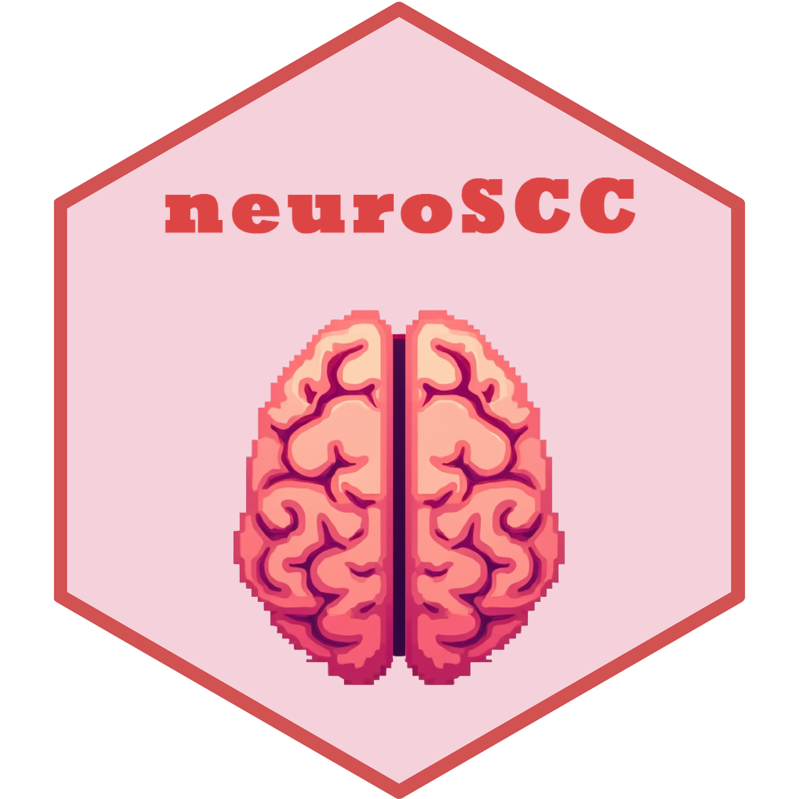

<h2 align="center" style="font-size:40px;">

neuroSCC R Package (v.0.10.0)

</h2>
<!-- Badge de ADMIN IGUANAMARINA -->

<!-- Badges -->

<!-- Descripción del paquete -->

**Maintainer:** Juan A. Arias
(<a href="mailto:iguanamarina@protonmail.com"
class="email"><em>iguanamarina@protonmail.com</em></a>)

**Main Goal:** To load PET data, re-organize it as a *data.frame*,
estimate Simultaneous Confidence Corridors for one or multiple groups of
patients, and compare them in order to find brain areas whose activity
falls out of estimated confidence intervals, thus evidencing changes in
brain activity in that region compared to the counterpart.

**Description:** This package provides auxiliary functions for
calculating Simultaneous Confidence Corridors (SCCs) on PET neuroimaging
data. It includes functions to load neuroimaging and demographic data in
the standard format required, and assists in various tasks throughout
the process. Overall, this package is designed to help with the
replication process of a cornerstone paper from my thesis “*Development
of statistical methods for neuroimage data analysis towards early
diagnostic of neurodegenerative diseases*” and it is best followed using
the scripts available at [the designated GitHub
Repository](https://github.com/iguanamarina/SCCneuroimage). Overall,
this serves as a support package, although it can work as a stand-alone
package for other projects related to PET imaging.

**References:**

> Wang Y, Wang G, Wang L, Ogden RT. Simultaneous confidence corridors
> for mean functions in functional data analysis of imaging data.
> *Biometrics*. 2020 Jun;76(2):427-437. doi:
> [10.1111/biom.13156](https://pubmed.ncbi.nlm.nih.gov/31544958/). Epub
> 2019 Nov 6. PMID: 31544958; PMCID: PMC7310608.

